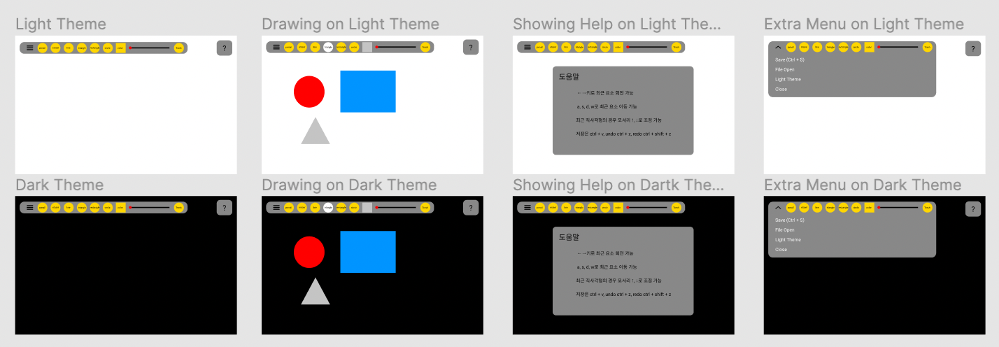

# 😀 SVG Drawing WebSite Using Vue.js 2

SVG (벡터기반) Drawing WebSite를 Vue.js 2를 활용하여 만들어볼 예정입니다.

구현 과정을 모두 공개할 예정이오니, 코드보다는 구현 과정에 집중해주시면 감사하겠습니다.

---

해당 레포를 clone 받으신 후 main.html을 실행하시면 사용하실 수 있습니다.

주의 : explorer 지원 X

---

## 💻 개발 환경

**노트북**: MacBook Air M1

**IDE**: Visual Studio Code: 1.56.2 (Universal)

**프레임워크**: Vue.js 2

**언어**: HTML, CSS, Javascript

- Node version: 16.10.0


## 🎨 Figma

[Figma 보러가기](https://www.figma.com/file/U6ELp3FmU5ELEVax63yBCs/Untitled?node-id=0%3A1)



---

## 📝 자료 탐색

### 🤔 svg 태그

벡터 기반 이미지를 지원하기 위해서는 svg 태그를 사용해야 합니다.

- svg 태그는 벡터 기반 그래픽을 XML 형식으로 정의입니다.
- svg 태그를 담는 그릇입니다.
- svg 태그에 담을 수 있는 하위 태그들이 있습니다. (자세한 태그 내용은 하단을 참고하세요)
- svg 태그는 파일의 모든 요소와 속성에 애니메이션을 적용할 수 있습니다.

svg는 기본적으로 아래와 같이 사용합니다.

```html
<svg>
  ...
</svg>
```

이를 통해 svg 컨테이너를 DOM에서 생성합니다.

### 😮 svg 하위 태그

svg 태그 안에는 벡터 기반 그래픽을 나타낼 수 있는 `지정된 여러개의 태그가 존재`합니다. 본 프로젝트에서는 이 중 몇개를 활용하여 Drawing Tool을 만들어보겠습니다.

1. 사각형: `<rect>`
2. 정원: `<circle>`
3. 타원: `<ellipse>`
4. 선: `<line>`
5. 다각선: `<polyline>`
6. 다각형: `<polygon>`
7. 패스: `<path>`
8. 다각라인: `<polyline>`

위와 같이 대표적인 7개의 태그 중 `<rect>`, `<circle>`, `<line>`, `<polygon>`를 사용하여 기본적인 도형과 선을 생성할 수 있도록 하겠습니다.

width와 height을 설정하여 영역을 지정할 수 있습니다. 물론 css를 활용하여 각 태그를 꾸미는 것도 가능합니다. 이때 사용되는 css 속성은 다음과 같습니다. 

#### ▭ `<rect>` 사각형 태그

- fill: 면색
- stroke: 선색
- stroke-width: 선 굵기
- fill-opactiy: 면 투명도
- stroke-opacity: 선 투명도
- opacity:  fill과 stroke 둘 모두를 control
- rx, ry: 모서리 radius 추가

#### 🟣 `<circle>` 원 태그

- cx, cy: x, y의 좌표를 의미합니다. 값을 작성하지 않으면, 0,0으로(default) 설정됩니다.
- r : 원의 반지름을 나타냅니다.

#### 📏 `<line>` 선 태그

- x1, y1: 선의 시작 좌표를 의미합니다.
- x2, y2: 선의 끝 좌표를 의미합니다.
- 중요한 것은 line은 선분 태그입니다.

#### 📐 `<polygon>` 다각형 태그

polygon 태그는 여러 다각형을 표현할 수 있습니다. 본 프로젝트에서는 삼각형을 표현하기 위해 사용합니다.

- points: 각 꼭지점의 좌표를 나타냅니다.

---

## 📝 새롭게 학습할 내용

#### 🤔 JSON.stringify

JSON.stringify는 javascript object를 json 형태로 변환합니다. 즉, 클라이언트와 서버간 통신 데이터의 유형의 json파일을 빠르게 만들 수 있습니다. JSON.stringify는 다음과 같은 내용을 담고 있습니다.

```javascript
JSON.stringify(value, replacer, space)
```

1. value: JSON 문자열로 변환할 값입니다. 배열, 숫자, 문자, 객체 등이 될 수 있습니다. value는 필수 값입니다.

2. replace: 함수 또는 배열이 될 수 있습니다. 이 때 값이 null이거나 제공되지 않으면, 객체의 모든 속성이 JSON 문자열 결과에 포함됩니다.

- replace의 함수를 통해 JSON 데이터로 변환하고 싶지 않은 유형의 경우 이를 제외시킬 수 있습니다.
- replace의 배열을 통해 배열의 값과 일치하는 값만 JSON 문자화 됩니다.

3. space: 가독성을 목적으로 json 문자열 출력에 공백이나 문자를 삽입한 형태로 출력됩니다. 이때 `문자열을 입력하면 공백이 아닌 문자열`로 `숫자는 공백의 개수`로 사용됩니다. 

#### 🤔 JSON.parse

JSON.stringify는 자바스크립트 데이터를 json로 바꾸는데 사용했다면, JSON.parse는 json 데이터를 자바스크립트 데이터로 바꾸는데 사용합니다. 사용법은 `JSON.parse(JSON데이터)`로 매우 간단합니다.

#### 🤔 Blob

[MDN](https://developer.mozilla.org/ko/docs/Web/API/Blob)

Blob은 파일의 불변인 미가공 데이터를 나타낸다고 합니다. 텍스트와 이진 데이터로 읽을 수 있으며, [ReadableStream](https://developer.mozilla.org/ko/docs/Web/API/ReadableStream)으로 변환후 관련 메소드를 통해서 데이터를 처리할 수 있습니다.

여기서 File 인터페이스는 사용자 시스템 파일을 지원하기 위해 Blob 인터페이스를 확장한 것으로 File 인터페이스는 모든 Blob 기능을 상속합니다.

Blob을 생성하려면 `Blob()` 생성자를 사용하면 됩니다.

위 프로젝트에서는 파일을 export 하기 위해 text를  `JSON.stringify(app.art)` 통해 만들었으며, 타입이 text이기 때문에, text/plain을 사용했습니다.

MDN 예제를 보고 만들었으며, a 태그를 생성한 이후 해당 링크와 다운로드할 경로 그리고 이를 click하여 다운로드 받는 것 까지 진행했습니다. 

#### 🤔 @keyframes

위 keyframes은 css 애니메이션을 사용하기 위해서 사용했습니다. 본 프로젝트에서는 `hamburger` 추가기능을 클릭했을 때 좀 더 스므스하게 아이콘이 등장하여 사용자 경험을 향상시키기 위해서 사용했습니다

도움말의 경우 transition을 사용하여 이를 스므스하게 페이지가 펼쳐지도록 했습니다.

#### 🤔 createObjectURL & revokeObjectURL

`URL.createObjectURL()` 정적 메서드는 주어진 객체를 가리키는 URL을 [DOMString](https://developer.mozilla.org/ko/docs/Web/API/DOMString)으로 반환합니다. 해당 URL은 자신을 생성한 창의 [document](https://developer.mozilla.org/ko/docs/Web/API/Document)가 사라지면 함께 무효화됩니다.

이때 중요한 것은 URL.createObjectURL()는 항상 새로운 객체를 생성하기 때문에 해당 객체를 사용하고 난 뒤에 URL.revokeObjectURL를 사용하여 URL.createObjectURL을 해제해야 합니다.

본 프로젝트에서는 이를 export 하기 위해서 사용했으며, a태그의 링크를 생성하기 위해 사용했습니다. 특히 만약에 사용하려는 text 객체가 null 값이 아니라면 revokeObjectURL를 사용하여 해당 링크를 제거한 뒤에 다시 생성하는 방식으로 메모리 관리를 수행했습니다.

#### 🤔 event.clientX, event.clientY 등 새로운 이벤트 property

위 이벤트는 그림과 여러 도형을 만들기 위해서 사용자가 누르는 button인 1과 3을 기반으로 그리고 싶은 위치를 판단합니다. 여기서 마우스를 기반으로 1번 버튼은 left, 3번은 마우스의 left와 right를 동시에 누르는 것 입니다. 물론 `해당 이벤트는 explorer에서는 지원되지 않는 기능`입니다.


## ⧲ 에러 확인 및 수정

1. DS_Store파일이 자동으로 생성되는 것을 확인했습니다. DS_Store 파일을 .gitignore에서 통제하는 방법은 다음과 같습니다.
   - 터미널에서 DS_Store가 있는 git폴더로 이동합니다.
   - `$ find . -name .DS_Store -print0 | xargs -0 git rm --ignore-unmatch -f`를 zsh 또는 bash 창에 입력합니다.
   - echo .DS_Store >> .gitignore를 입력합니다.
   - 이후 add, commit, push를 진행합니다.

2. 다크 테마 바뀔 시, 위 `네브바가 닫히지 않았습니다.`
   - 아직 hamburger 토글을 버튼 이벤트에 따라 바뀌는 함수를 작성하지 않았습니다. 작성 후 해결했습니다.
3. `svg태그 안 컨테이너 배경색이` 바뀌지 않는 것을 확인했습니다.
   - 해당 css artboard 클래스를 만들지 않아서 생긴 문제였습니다. 해당 클래스에 transition를 추가하여 변경하였습니다.
4. redo의 경우 한글로 적용할 경우 작동하지 않는 것을 확인했습니다.


